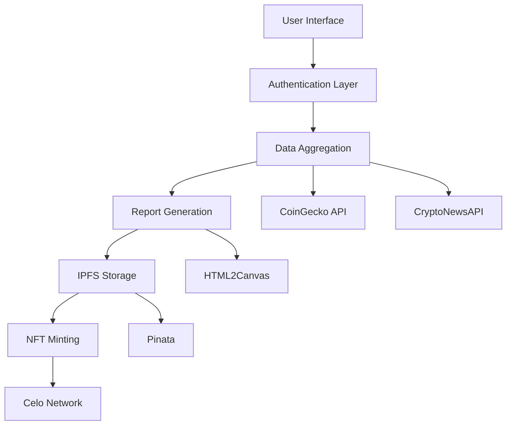

# Celo Nyfa App

## Short Description
Celo Nyfa: AI-powered crypto research platform generating shareable PNG reports with key market insights & sentiment analysis, with optional NFT minting on Celo. Your pocket crypto analyst. 📊🔍 #CryptoResearch #Celo

## Quick Links
- [Project Assets (Logos, Screenshots)](https://github.com/nyfaapp/celo-nyfa-app/tree/main/src/assets)
- [Video Explaining Work](https://youtu.be/B_F259llSPo)
- [Presentation](https://www.canva.com/design/DAGf_Y5ZUx4/wcFPojTj7t0H-zj0Ch_1pg/view?utm_content=DAGf_Y5ZUx4&utm_campaign=designshare&utm_medium=link2&utm_source=uniquelinks&utlId=h16e8852664)

## Problem
A fundamental issue in crypto investing is that many investors skip doing their own research (DYOR) due to:
- Time constraints in analyzing multiple research platforms
- Complexity of aggregating data from various sources (Messari, Arkham, CoinGecko, etc.)
- Overwhelming amount of information to process
- Lack of easy-to-digest format for quick decision making

While platforms like Messari and Arkham provide excellent data, users often:
- Don't have time to visit multiple platforms
- Get overwhelmed by complex dashboards
- End up making investment decisions without proper research
- Miss critical information spread across different sources

## Solution & Vision
Nyfa captures a moment in a cryptocurrency's lifetime, similar to what [carbon](https://carbon.now.sh/) does for code snippets. Users can generate and download shareable PNGs containing crypto asset reports, which can then be minted as NFTs.

Nyfa solves the research challenge by:
- Aggregating essential data from multiple trusted sources into one view
- Presenting information in an easy-to-digest visual format
- Making research shareable and verifiable through NFTs
- Reducing the time needed for basic but comprehensive research
- Lowering the barrier to conducting proper DYOR

## Deployment
NoFA NFT Contract Address (Celo Alfajores): `0x7f5b1F68079b885512f6338C17466d53BC5A213C`

## Core Features

### 1. Cryptocurrency Data Integration
- Access to over 17,000 cryptocurrencies
- Integration with CoinGecko and CryptonewsAPI
- Real-time market data and news sentiment analysis

### 2. Report Generation
- Creation of `NoFA` (Not Financial Advice) reports
- PNG generation using HTML2Canvas
- Customizable report layouts

### 3. IPFS Integration
- Seamless upload to Pinata
- IPFS-based storage with permanent links
- Decentralized file management

### 4. NFT Implementation
- ERC721URIStorage-based smart contract
- Metadata linking with IPFS content
- Automated minting process

### 5. User Interface
- Intuitive crypto selection
- Background API processing
- Pinata integration for storage
- RainbowKit wallet connectivity

## Technical Architecture

### System Architecture Diagram


### Technology Stack
- Frontend: Next.js, TypeScript, TailwindCSS
- Authentication: Supabase Auth
- Database: Supabase Postgres
- Blockchain: Celo Network
- Storage: IPFS (Pinata)
- Web3: RainbowKit, ethers.js
- APIs: CoinGecko, CryptoNewsAPI
- Monitoring: Sentry
- Analytics: Mixpanel

### Frontend Flow
1. User Authentication
   ```
   Creator creates an account
   ↓
   They are authenticated using Supabase Anon Auth
   ↓
   They can create a NoFA which is saved to Supabase Postgres Database
   ```

2. NoFA Creation Process
   ```
   Creator selects a coin
   ↓
   The coin id is used to call CoinGecko API for data
   ↓
   The coin id is also used to call CryptoNewsAPI for news headlines and sentiment
   ↓
   The NoFA is created using the fetched data
   ↓
   A user can see that information
   ```

### Smart Contract Flow
```
Creator saves the PNG to Pinata
↓
Pinata returns an IPFS link 
↓
Creator creates NFT, which uses the IPFS link as metadata to the PNG
```

### Implementation Challenges
1. Image Generation
   - Challenge: HTML2Canvas library doesn't render iframes in PNG generation
   - Solution: Exploring alternatives to replace iframe-based content display for better PNG output

2. Data Provider Limitations
   - Challenge: CryptoNewsAPI's trial period (4 days) and high pricing limiting news integration
   - Solution: Investigating alternative news providers like CryptoPanic for more sustainable integration

3. Web3 Integration
   - Challenge: Initial issues with Coinbase's OnchainKit
   - Solution: Migrated to RainbowKit for improved reliability and user experience

## Data Models

### Creator
```typescript
interface Creator {
    id: string;
    authId: string;
    userWalletAddress: string;
    privyWalletAddress: string;
    privyWalletId: string;
    timeCreated: string;
}
```

### NoFA
```typescript
interface NoFA {
    id: string | null;
    coinId: string
    creatorAuthId: string | null | undefined; 
    txnHash: string | null | undefined;
    ipfsURI: string | null | undefined;
    coinImageURI: string | null | undefined;
    marketCap: number | null | undefined;
    totalSupply: number | null | undefined;
    circulatingSupply: number | null | undefined;
    headlines: Headline[] | null | undefined;
    timeCreated: string | null | undefined;
}
```

### News Components
```typescript
interface NewsItem {
    title: string;
    image_url: string;
    news_url: string;
    sentiment: "Positive" | "Negative" | "Neutral";
}

interface Headline {
    title: string | null | undefined;
    imageURL: string | null | undefined;
    link: string | null | undefined;
    sentiment: "Positive" | "Negative" | "Neutral" | null;
}
```

## Development Roadmap

### Phase 1: Wallet Integration & Testing (Month 1)
- Migration from Coinbase's `OnchainKit` to `RainbowKit`
- MiniPay optimization
- Celo Alfajores testnet deployment

### Phase 2: Monetization (Month 2)
- Implementation of NFT minting fees
- NoFA generation payment system
- Revenue model optimization

### Phase 3: AI Integration - Nyla (Month 3)
- Development of Nyfa SDK with AI capabilities
- Public SDK release
- AI-powered feature expansion