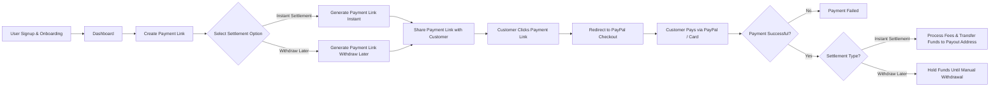
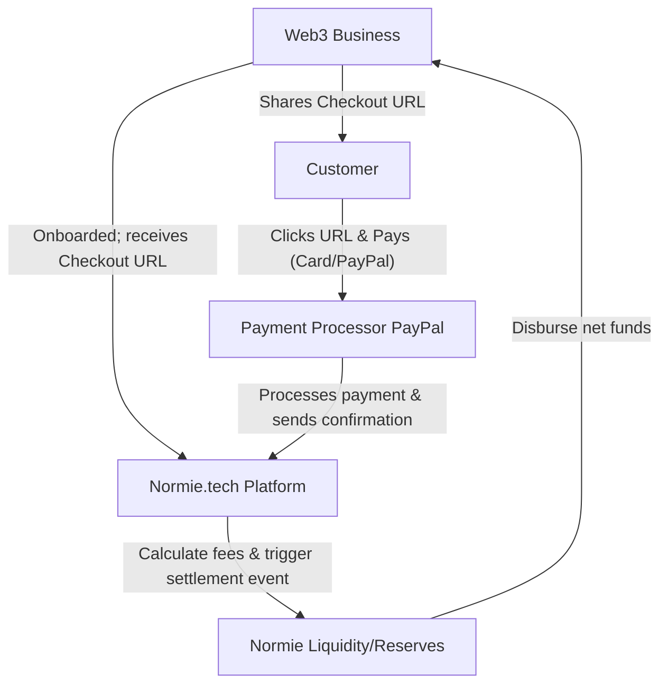
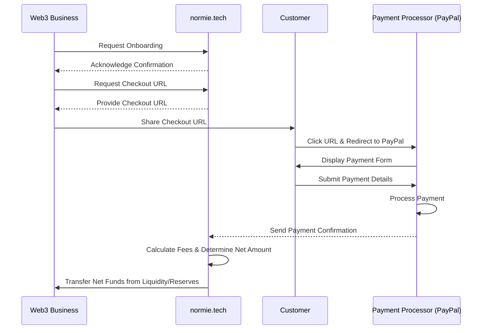

# Normie Tech

## GitHub repository 

**[Normie.Tech Github](https://github.com/normiedottech/normie.tech)**

## Team Members GitHub username
**[dipanshuhappy](https://github.com/dipanshuhappy)**

**[Nithin-Varma](https://github.com/Nithin-Varma)**

**[arrytiwari](https://github.com/arrytiwari)**

## Former Participation in Celo Hackathons

- Submitted Normie.Tech as a part of the Celo SF residency

## Monthly Goal for this Proof of Ship

- Build Webhooks.
- Onboarding new users

### Previous month work done
Implemented paypal payment processor, replenishing tokens, other fixes and new features implemented as per users demands

- [Paypal Integration](https://github.com/normiedottech/normie.tech/pull/48)
- [Replenishing Tokens](https://github.com/normiedottech/normie.tech/pull/43)

## Problem
Web3 businesses lose 85% of potential customers who want to pay with cards but can’t navigate crypto wallets, KYC hurdles, or volatile settlements.

**For Users**: Painful on-ramps, KYC delays, waiting for crypto deposits, and multi-step transfers.

**For Web3 Businesses**: Difficulty accepting payments from web2 users due to crypto complexities.

## Solution
[Normie.tech](https://normie.tech/) accept card payments from your customers and auto-convert them to instant stablecoin settlements for you, no crypto complexity for your customers.

### Why It Matters:
**For Web3 Businesses**: Tap into 4B+ card users, slash payment friction, and grow revenue 20-30% faster.

**For Web2Users**: Pay with cards they already trust. 

**No Wallets + No KYC = No Worries**

🚀 Turn payment barriers into growth engines.

## Flow Chart



## Architecture Diagram


## Sequence Diagram

## Deployed Contract Addresses on Celo

Here are the Addresses
 - Reserve Address: ```0xF7D1D901d15BBf60a8e896fbA7BBD4AB4C1021b3```