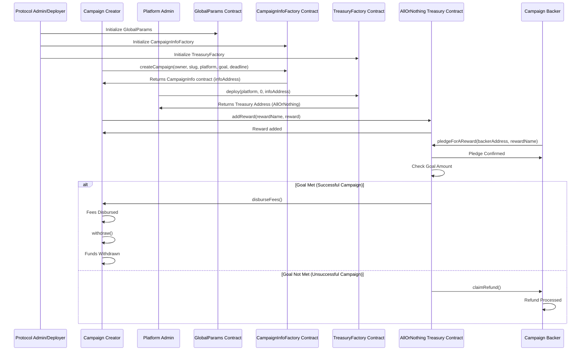

# Akashic  

## Link to your project's GitHub repository  
[Akashic GitHub Repository](https://github.com/akashic-fund/akashic)  

## Team Members GitHub username  
- **James** - [positonic](https://github.com/positonic)  
- **Prajjawal** - [Prajjawalk](https://github.com/Prajjawalk)  
- **Shikhar** - [0xshikhar](https://github.com/0xshikhar)  

## Former Participation in Celo Hackathons  
We are a new project on Celo.  

## Monthly Goal for this Proof of Ship  
Our goal this month is to enhance the platform's core functionality and user experience through several key initiatives:

1. **NFT Integration with Numbers Protocol**
   - Implement NFT minting functionality
   - Complete integration with Numbers Protocol

2. **Campaign & Donation System Improvements**
   - Upgrade campaign management features
   - Transition from ETH to USDC for donations
   - Enhance donation flow

3. **Rounds System Development**
   - Implement rounds-to-campaign mapping
   - Build approval workflow for rounds
   - Optimize rounds functionality

4. **Platform Enhancement**
   - Add search functionality
   - Develop admin dashboard features
   - Optimize backend queries for better performance

Weekly Milestones:
- Week 1: Deploy search functionality and admin features, optimize backend
- Week 2: Develop rounds system and mapping
- Week 3: Implement USDC donation flow and campaign updates
- Week 4: Complete Numbers Protocol integration and NFT minting

### Detailed description of the work you did this month during the contest

*(Only PRs from approximately the last 21 days are shown)*

#### NFT & Numbers Protocol Integration
- [#42 Feat: Minting an NFT on numbers protocol](https://github.com/Akashic-fund/akashic/pull/42)
- [#40 Feat numbers](https://github.com/Akashic-fund/akashic/pull/40)

#### Campaign & Donation Management
**Campaign Enhancements:**
- [#31 feat campaign update](https://github.com/Akashic-fund/akashic/pull/31)

**Donation Flow:**
- [#38 feat change token from ETH to USDC [AXH-76]](https://github.com/Akashic-fund/akashic/pull/38)

#### Rounds & Mapping
- [#37 Add to rounds -> after approved](https://github.com/Akashic-fund/akashic/pull/37)
- [#33 Add: rounds <> campaign mapping](https://github.com/Akashic-fund/akashic/pull/33)
- [#32 update: rounds](link-to-pr-32)

#### User Experience & Visual Improvements
**Search & Navigation:**
- [#39 feat add search function [AXH-79]](https://github.com/Akashic-fund/akashic/pull/39)

#### Administrative & Dashboard Features
**Admin Tools:**
- [#36 patch /admin](https://github.com/Akashic-fund/akashic/pull/36)

#### Backend & Database Improvements
- [#35 feat query & optimization [AXH-83]](https://github.com/Akashic-fund/akashic/pull/35)

#### Miscellaneous Fixes
- [#34 fix](https://github.com/Akashic-fund/akashic/pull/34)

##### **Miscellaneous Fixes**  

###### **Code & Build Quality**  
- Removed unused code, fixed build errors, and resolved various breakages  

#### **Links to PRs/Commits**  
[Add links to specific PRs/commits for the features described above]  

## Problem  

Akashic addresses the challenge of preserving the cultural heritage and multimedia expressions of refugees and displaced communities. These communities often lose access to their cultural artifacts, oral histories, music, and artistic expressions due to forced migration, conflict, and displacement.  

Traditional archives may fail to capture the nuanced, multimedia nature of this cultural heritage, or they may be inaccessible to displaced individuals. Furthermore, the lack of financial support and recognition for creators from these communities exacerbates the problem.  

## Solution  

We help refugees and displaced communities build financial independence and preserve their cultural heritage by providing direct access to global supporters, secure financial services, and tools for community-driven initiatives.  

### **Key Features**  
- **Preserve Culture and Identity:** Decentralized archive using IPFS technology to ensure cultural heritage remains accessible.  
- **Empower Creators:** Monetization and fundraising tools, Web3 wallets, and access to financial services.  
- **Foster Collaboration and Community Building:** Enable direct connections between creators, donors, curators, and supporters.  

### **Why Akashic?**  
- **Banking the Unbanked** - Providing financial inclusion through Web3 wallets  
- **Last Mile Distribution** - Ensuring funds reach creators directly  
- **Community-Driven Initiatives** - Empowering creators to control their cultural assets  
- **Creator Economy** - Helping creators monetize their work  
- **Decentralized Archive** - Using IPFS and blockchain for immutable preservation  

## Architecture  

**Tech stack:**
@numbersprotocol/nit
Viem
WAGMI

## Deployed Contract Addresses on Celo	

- We have no new smart contract addresses this month 	