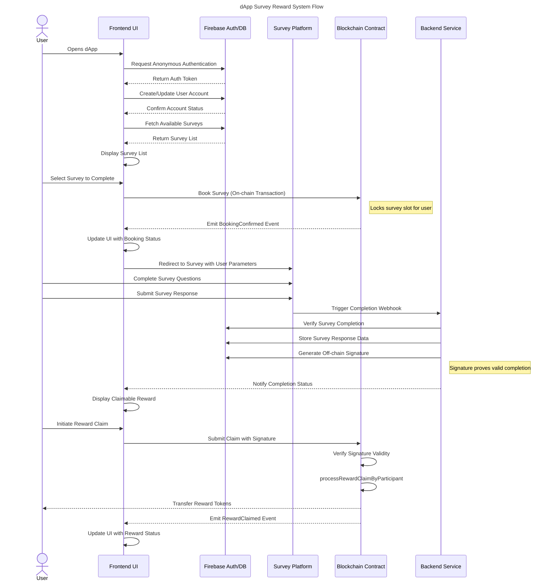

# Canvassing - Participant: Online Surveys, Paid in Tokens

## Short Description

online surveys that reward participants for answering questions, built on Celo

## Link to GitHub repository
https://github.com/andrewkimjoseph/canvassing-participant.git

## Link to Video
- to be updated upon completion of video demo creation

## Link to Deck
- to be updated upon completion pitch deck creation

## Link to assets
https://github.com/andrewkimjoseph/canvassing-participant/tree/main/assets

## Team Members GitHub username

- Andrew Kim Joseph
  - [GitHub](https://github.com/andrewkimjoseph)
  - [Twitter](https://x.com/andrewkimjoseph)
  - [Farcaster](https://warpcast.com/andrewkimjoseph)

- Benedictors Ogada
  - [Twitter](https://x.com/Ben_Diktos)

## Former Participation in Celo Hackathons

- [Build with Celo 5 project - First Place](https://github.com/andrewkimjoseph/pamoja-app-awg) 
- [Build with Celo 6 project - First Place](https://github.com/andrewkimjoseph/stekcit-bwc) 
- [Build with Celo 7 project - First Place](https://github.com/andrewkimjoseph/canvassing) 
- [Proof of Ship Season 1 - Sixth Place](https://github.com/nyfaapp/celo-nyfa-app)

## Monthly Goal for this Proof of Ship

https://gap.karmahq.xyz/project/canvassing/grants/0x5b0f752718f3595bd2c9d32fc1837fab9890aa243c690a72606a610758609244/milestones-and-updates

## Problem

1. Traditional survey platforms require you to meet a minimum withdrawal threshold (e.g., 5 USD) before you can access your earnings.
2. Most platforms require linking a payment method that demands Know Your Customer (KYC) verification, such as PayPal.
3. Traditional platforms only process payouts during business days/hours, causing delays in receiving your earnings.

## Solution

1. By using stablecoins with more decimal places, we can transfer amounts as small as 0.01 cUSD directly to your account, enabling microtransactions.
2. We use MiniPay, a no-KYC dollar stablecoin wallet that only requires a Google account and phone number to sign up, eliminating invasive verification processes.
3. Our smart contract can process payments anytime through its [processRewardClaimByParticipant] method, allowing instant payouts regardless of time or day (as long as the blockchain is active and the participant has sufficient gas fees).

## Architecture

### Overview
Canvassing is built using Next.js for the frontend and Firebase for backend services. The application combines Web2 and Web3 technologies to create a seamless survey participation and reward system.

### Tech Stack
- **Frontend**: Next.js 13 (App Router)
- **Backend**: Firebase (Authentication, Firestore)
- **Forms**: Tally Forms
- **Blockchain**: Solidity Smart Contracts
- **Web3 Integration**: viem.js

### Flow Diagram

## Contracts on Celo

- to be deployed upon completion of Milestone 4
