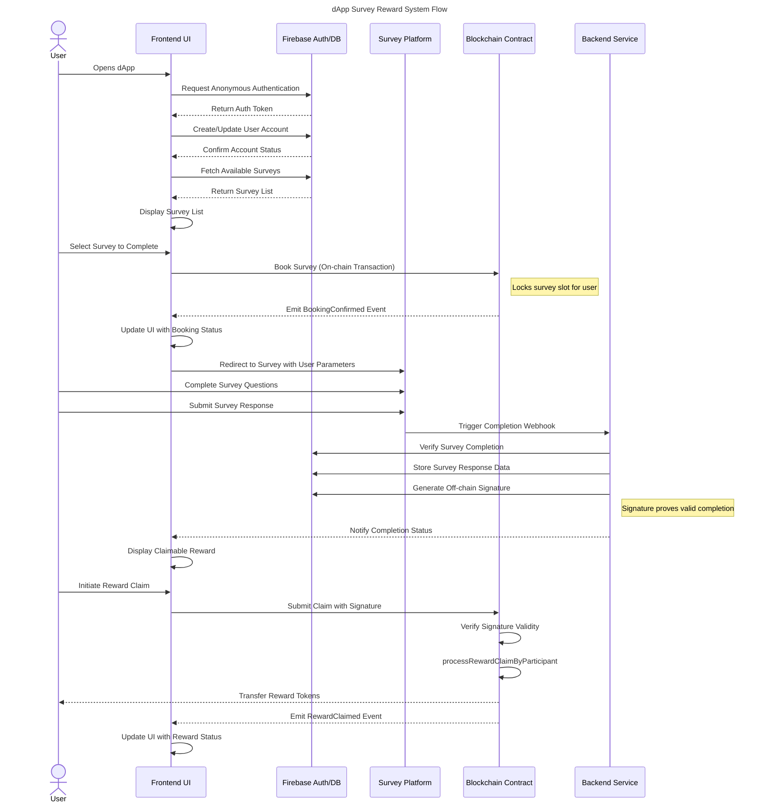

# Canvassing - Participant: Online Surveys, Paid in Tokens

## Short Description

online surveys that reward participants for answering questions, built on Celo

## Link to GitHub repository
[GitHub](https://github.com/andrewkimjoseph/canvassing-participant.git)

## Link to Video
[Video](https://www.youtube.com/watch?v=nK_TJN7ecOc)

## Link to Deck
[Deck](https://www.figma.com/deck/7Nb7XGL4JGT6mFF72YnyGy/Canvassing-Pitchdeck?node-id=12-1885&t=gYZybnBbnuf8x2L7-1)

## Link to assets
[Assets](https://github.com/andrewkimjoseph/canvassing-participant/tree/main/assets)

## Team Members GitHub username

- Andrew Kim Joseph
  - [GitHub](https://github.com/andrewkimjoseph)
  - [Twitter](https://x.com/andrewkimjoseph)
  - [Farcaster](https://warpcast.com/andrewkimjoseph)

- Benedictors Ogada
  - [Twitter](https://x.com/Ben_Diktos)

## Former Participation in Celo Hackathons

- [Build with Celo 5 project - First Place](https://github.com/andrewkimjoseph/pamoja-app-awg) 
- [Build with Celo 6 project - First Place](https://github.com/andrewkimjoseph/stekcit-bwc) 
- [Build with Celo 7 project - First Place](https://github.com/andrewkimjoseph/canvassing) 
- [Proof of Ship Season 1 - Sixth Place](https://github.com/nyfaapp/celo-nyfa-app)

## Monthly Goal for this Proof of Ship

[Monthly Goal](https://gap.karmahq.xyz/project/canvassing/grants/0x5b0f752718f3595bd2c9d32fc1837fab9890aa243c690a72606a610758609244/milestones-and-updates)

## Problem

1. Traditional survey platforms require you to meet a minimum withdrawal threshold (e.g., 5 USD) before you can access your earnings.
2. Most platforms require linking a payment method that demands Know Your Customer (KYC) verification, such as PayPal.
3. Traditional platforms only process payouts during business days/hours, causing delays in receiving your earnings.

## Solution

1. By using stablecoins with more decimal places, we can transfer amounts as small as 0.01 cUSD directly to your account, enabling microtransactions.
2. We use MiniPay, a no-KYC dollar stablecoin wallet that only requires a Google account and phone number to sign up, eliminating invasive verification processes.
3. Our smart contract can process payments anytime through its [processRewardClaimByParticipant] method, allowing instant payouts regardless of time or day (as long as the blockchain is active and the participant has sufficient gas fees).

## Architecture

### Overview
Canvassing is built using Next.js for the frontend and Firebase for backend services. The application combines Web2 and Web3 technologies to create a seamless survey participation and reward system.

### Tech Stack
- **Frontend**: Next.js 13 (App Router)
- **Backend**: Firebase (Authentication, Firestore)
- **Forms**: Tally Forms
- **Blockchain**: Solidity Smart Contracts
- **Web3 Integration**: viem.js

### Flow Diagram

## Contracts on Celo

### Contracts on Celo Alfajores
- [0x409cbf13fbd3b98e61f1f77b3a4cef1f39a2c49a](https://alfajores.celoscan.io/address/0x409cbf13fbd3b98e61f1f77b3a4cef1f39a2c49a) 
- [0x63bdeb2840349878b99ede9ddd6e5754dd575c10](https://alfajores.celoscan.io/address/0x63bdeb2840349878b99ede9ddd6e5754dd575c10) 
- [0x8f0c3451baf5646a9e22210828a111bb9e289d67](https://alfajores.celoscan.io/address/0x8f0c3451baf5646a9e22210828a111bb9e289d67) 
- [0x462a8a53debe19f62a15930b0b176090f97c4a23](https://alfajores.celoscan.io/address/0x462a8a53debe19f62a15930b0b176090f97c4a23) 
- [0xcb30123c469023a0bf3c8d01cf3779d651477171](https://alfajores.celoscan.io/address/0xcb30123c469023a0bf3c8d01cf3779d651477171) 
- [0x104f45f325b103d850768a8ac5bfc31aa593e3e5](https://alfajores.celoscan.io/address/0x104f45f325b103d850768a8ac5bfc31aa593e3e5) 
- [0xe3c57abf12f39fd1822c24aa8d8131081744034a](https://alfajores.celoscan.io/address/0xe3c57abf12f39fd1822c24aa8d8131081744034a)  
- [0xC99AD405822d40B2d195b442E8AA0D61E0C50492](https://alfajores.celoscan.io/address/0xC99AD405822d40B2d195b442E8AA0D61E0C50492)  
- [0xfCEaAB2aDbb971B87C8AFB5170e39ec854619405](https://alfajores.celoscan.io/address/0xfCEaAB2aDbb971B87C8AFB5170e39ec854619405)
- [0x259C9cBA61F599Fe18e7F9f0459aec960c4fa6E9](https://celo-alfajores.blockscout.com/address/0x259C9cBA61F599Fe18e7F9f0459aec960c4fa6E9)
- [0x402faddf7578b081b8b4b7e826699f4e33770e5b](https://alfajores.celoscan.io/address/0x402faddf7578b081b8b4b7e826699f4e33770e5b)

### Contracts on Celo Mainnet
- [0x87C8FcB7A80e11a5954697622a653907adF4a42e](https://celoscan.io/address/0x87C8FcB7A80e11a5954697622a653907adF4a42e)  
- [0x18bd5146ee12d3ae3c1f5114678bd6b1de46bb56](https://celoscan.io/address/0x18bd5146ee12d3ae3c1f5114678bd6b1de46bb56)
- [0x69d1FBDdbF327F1BC27dDeF49Cda0eF4C7ed1f10](https://celo.blockscout.com/address/0x69d1FBDdbF327F1BC27dDeF49Cda0eF4C7ed1f10)